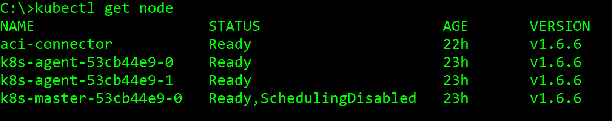
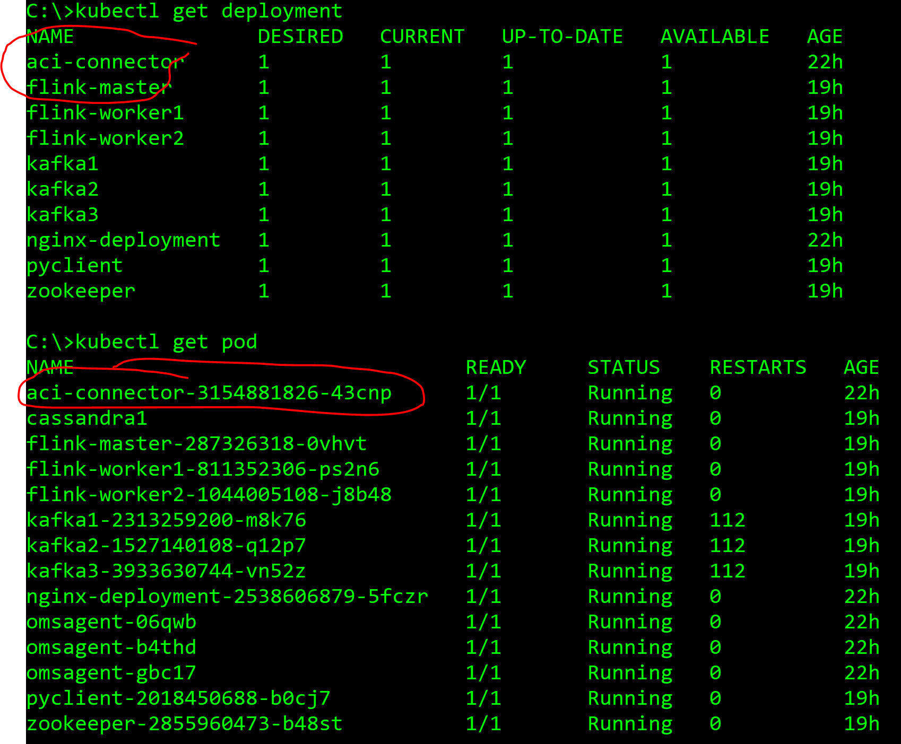
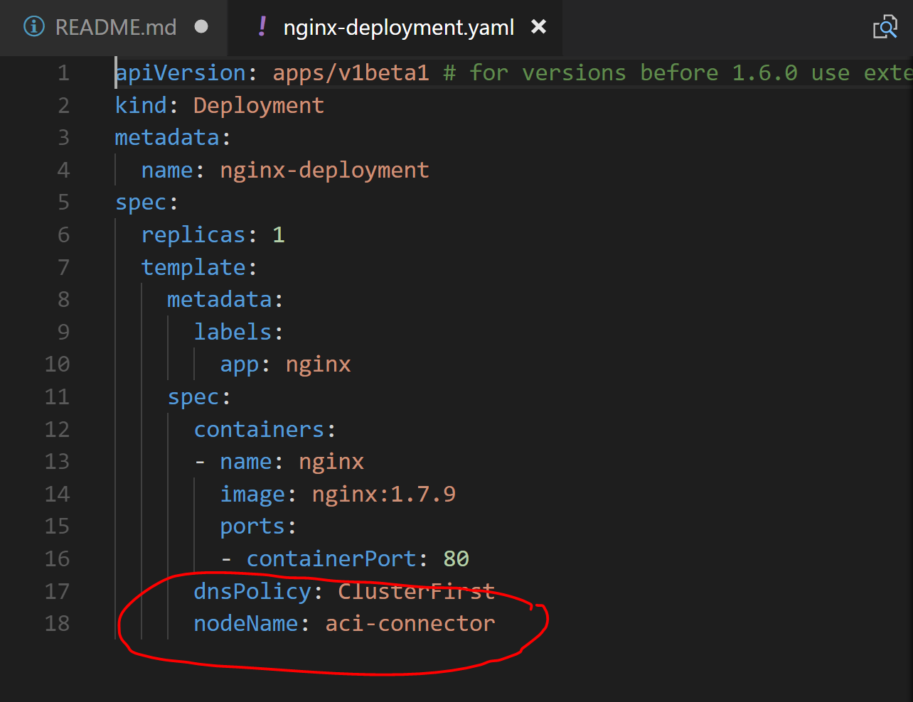
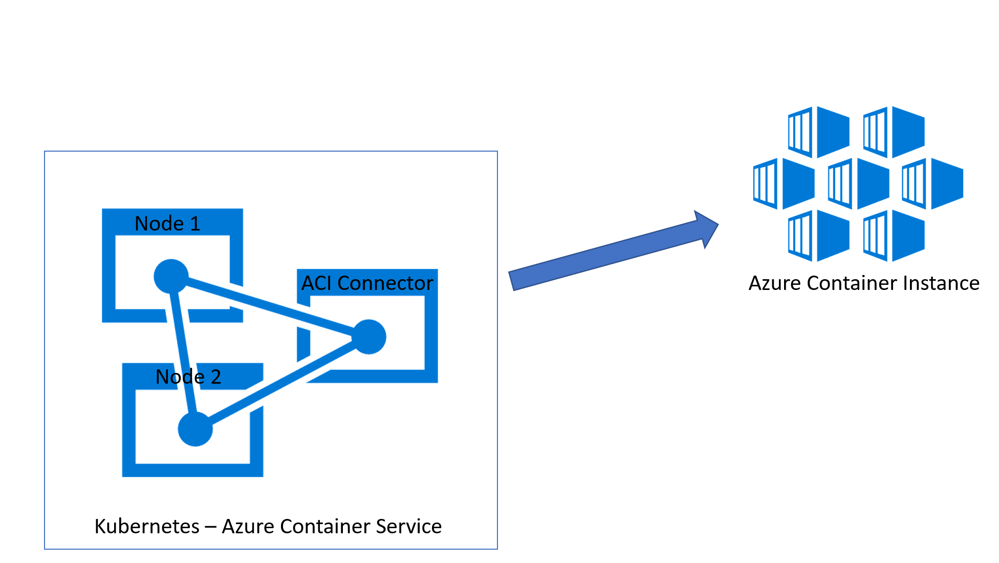
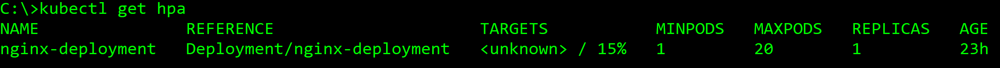

# High scale kubernetes on Azure Container Services using Azure Container Instances

This document will help you to deploy Azure Container Instance on Kubernetes cluster (running on Azure Container Service). 
Azure Container Instance (ACI) allow to run containers directly on Azure, without the requirement to deploy hosts. You can find more information about this resource [here](https://azure.microsoft.com/en-us/services/container-instances/).

Note: until the date of this documentation (September 21 - 2017) the ACI feature is on Preview. Check the link above about more updates.

## Why use Azure Container Instances (ACI) as a node in Azure Container Services (ACS) Kubernetes?

Use the serverless features of Azure Container Instances **(ACI)** can help your application use extra power to support high unpredictable loads with no need to add more raw power (masters and agents) to your Azure Container Services Cluster **(ACS)**.

Using this strategy can help you to support different architectures and usage scenarios:
- Push temporarily a container to ACI to support a higher number of application requests;
- Run Containers in a job pre defined schedule routine;
- Run containers that use batch process and run in a certain schedule frequency;
- Run containers as functions that will be triggered by any other container or service;

When you install the ACI connector in your ACS Kubernetes cluster you will see a new node in your Kubernetes Cluster that you can push new containers there.


## Architecture

This deployment use ACI Connector to scale Pods, Deployments and Jobs to Azure Container Instance service. After the installation of the ACI Connector (using an YAML file) you will see the ACI Connector as an additional node.



Also you can check the ACI Connector as a Deployment and Pod



Using YAML to deploy on Kubernetes just add the parameter **nodeName** (use the name of the connector) to **Spec** field:

 

Diagram about the structure




## Requirements

1. Deploy Kubernetes on ACS:

https://github.com/fabioharams/kubernetes

2. Deploy ACI Connector on Kubernetes

https://github.com/Azure/aci-connector-k8s


## Deploy to ACI Connector

You can use following example bellow to deploy NGINX as a Deployment (code is available at **script** folder on this repository)

```yaml
apiVersion: apps/v1beta1 # for versions before 1.6.0 use extensions/v1beta1
kind: Deployment
metadata:
  name: nginx-deployment
spec:
  replicas: 1
  template:
    metadata:
      labels:
        app: nginx
    spec:
      containers:
      - name: nginx
        image: nginx:1.7.9
        ports:
        - containerPort: 80
      dnsPolicy: ClusterFirst
      nodeName: aci-connector
```

## Scale Deployments

You can scale deployments, replicaset or replicationcontroller using HPA (Horizontal Pod Autoscaler) feature on Kubernetes. This command works with deployments (using ACI Connector or not) and you can do through **KUBECTL** command.

```kubectl
kubectl autoscale deployment nginx-deployment --min=1 --max=20 --cpu-percent=30
```

This example show how to scale the deployment **nginx-deployment** with a minimum of 1 Pod and maximum of 20 Pods. Also this will set a target of 30% of CPU utilization.

To check all the autoscale rules just type the following command:

```kubectl
kubectl get hpa
```



You can change the rule just using the same name for the deployment.

* Note: if you delete your deployment remember that the autoscale rule remains. You can create another deployment with the same name and the autoscale will continue working.


## Issues

ACI Connector is a public preview and probably some os these issues will be fixed later. However we listed just for your information:  

* Using this deployment under ACI Connector allows Kubernetes to scale Pods normally. However the parameter --cpu-percent will not have effect (during our tests we had setup the --cpu-percent to low values and the website continued responding very fast)  

* Some management tools for Kubernetes like [Kube-Ops-View](https://github.com/hjacobs/kube-ops-view) and [OMS](https://blogs.technet.microsoft.com/msoms/2017/04/03/monitor-kubernetes-containers-with-oms-insight-analytics-container-monitoring-solution/) doesn`t work properly. 
